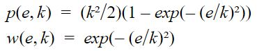
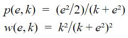
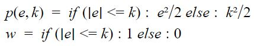

| [Tutorials Home](index.md) | [Previous](ApplyingDataFilters.md) | [Next](ICPIntro.md) |
| :--- | :---: | ---: |

# Outlier Filters Families

This section adresses the various filters and tries to organise them in families. The families are based on the influence functions of the cost function associated to an outlier filter. The purpose of outlier filtering, applied to point cloud registration, is to reduce the effect of outliers, improve the error minimisation and improve the crispness of the registered point clouds.

Appart for the Other family, the presentation of the families and functions is the following. The functions were plotted with an error variable (noted e) ranging from [-4,4] with a step of 0.01. The plot of a family is made with a value of k = 1. The first plot of a function is made with values of k = 0.5, k = 2 and k = 4. Then a second plot is proposed for values of k ranging from [0,2] with a step of 0.1.

This catalog was made from thanks to Philippe Babin's Mémoire on the analysis of error functions for the Iterative closest point algorithm: P.Babin, "Analysis of Error Functions for the Iterative Closest Point Algorithm", pp.70-72.

Libpointmatcher provides an implementation of the following outlier filters:

* Cauchy
* Welsch
* Switchable-Constaint
* Geman-McClure
* Tukey
* Huber
* L1
* Student

## Filter Index
### [Pseudo-Sinus Family](#pseudosinfamilyhead)
1. [Cauchy](#cauchyhead)
2. [Geman-McClure (GM)](#gemanmcclurehead)
3. [Welsch](#welschhead)
4. [Tukey](#tukeyhead)
5. [Andrew](#andrewhead)
6. [Kernel-Correlation (KC)](#kernelcorrelationhead)
7. [Fast Global Registration (FGR)](#fastglobalregistrationhead)

### [Linear Family](#linearfamilyhead)
8. [L2](#l2head)
9. [Switchable-Constraint (SC)](#switchableconstrainthead)
10. [Maximum-Distance (MaxDist)](#maximumdistancehead)
11. [Generalized ICP (GICP)](#gicphead)

### [Step Family](#stepfamilyhead)
12. [L1](#l1head)
13. [Huber](#huberhead)
14. [Logistic](#logistic)
15. [LM-ICP](#lmicphead)
16. [Fair](#fairhead)

### [Percentile Family](#percentilefamilyhead)
17. [Trimmed](#trimmedhead)
18. [Median](#medianhead)
19. [FICP](#ficphead)
20. [AICP](#aicphead)

### [Other Family](#otherfamilyhead)
21. [Student](#studenthead)
22. [Sparse-ICP](#sparsehead)
23. [EM-ICP](#emicphead)
24. [RANSAC](#ransachead)
25. [Relative Motion Threshold (RMT)](#rmthead)
26. [BiDistance](#bidistancehead)

## Descriptions

Outlier filters come in different forms. However the most common is a cost function noted p(e,k) associated with a weight function noted w(e,k). The value e is the error associated with a pair of matches and k is a tuning parameter. An influence function is the first derivative of a cost function p'(e,k). For most cases the influence function can be approximated by p'(e,k) = ew(e,k).

### Effect of the tuning parameter k

The weighted linear regression was used in order to illustrate the effect of k on outlier filtering. For this example, the chosen outlier filter is Cauchy and the problem is to have better results than an unweighted linear regression. The tuning of the k parameter will determine the efficiency of the outlier filtering. In the following example, a value of k which is nearly equal to the maximum error on the first iteration results nearly as poor as un unweighted linear regression.

The following plot represents how the outliers and inliers are affected by the cost function and weight function. The poor results of k = 4 can also be seen in this plot. Indeed, the weight of some outliers is the same as the weight of some inliers for lower values of k. This means that for values of k too big (relative to the point cloud) some outliers will be considered as inliers. The opposite effect can happen where the value of k is so low that some inliers are downweighted like outliers. This means that some prior knowledge of the point cloud is necessary for a fine tuning of the k parameter.

## Families Catalogue

### Pseudo-Sinus Family 

This family of outlier filters is characterized by an influence function that looks like one period of the sinusoid function. The value of k affect the width of the period. Past the sinusoidal behavior, the influence function becomes null. Usually, inliers are affected by the sinusoidal part while the outliers are affected by the null part of the function.

The sinusoidal aspect of this family is well presented by Andrew and Tukey which provides a sharp transition between the effect on inliers and outliers. Welsch, Cauchy and Geman-McClure provide an influence function with a smooth transition between the effect on inliers and outliers. Kernel-Correlation and Fast Global Registration are identical to other functions of the family. Therefore they overlap with those functions, Welsch and Geman-McClure respectively, and can't be seen on the plot.

#### Cauchy 

Equations:

Plots:

Original reference:
M. Bosse and R. Zlot, "Continuous 3D scan-matching with a spinning 2D laser", 2009 IEEE International Conference on Robotics and Automation,pp.4312-4319,2009.

#### Geman-McClure 

Equations:

Plots:

Original reference:
S. Geman, D.E. McClure, and D. Geman, "A nonlinear filter for film restoration and other problems in image processing", CVGIP: Graphical Models and Image Processing, vol. 54, no.4, pp.281-289, 1992.

#### Welsch 

Equations:

Plots:

Original reference:
R.E. Welsch, "Robust Regression Using Iteratively Reweighted Least-squares", Communications in Statistics - Theory and Methods, vol. 6, no. 9, pp.813-827, 1977.

#### Tukey 

Equations:

Plots:

Original reference:
R.E. Welsch, "Robust Regression Using Iteratively Reweighted Least-squares", Communications in Statistics - Theory and Methods, vol. 6, no. 9, pp.813-827, 1977.

#### Andrew 

Equations:

Plots:

Original reference:
R.E. Welsch, "Robust Regression Using Iteratively Reweighted Least-squares", Communications in Statistics - Theory and Methods, vol. 6, no. 9, pp.813-827, 1977.

#### Kernel-Correlation (KC) 

Kernel Correlation is a registration algorithm known to use the Welsch outlier filter.

Equations:

Original reference:
Y.Tsin and T.Kanade, "A Correlation-Based Approach to Robust Point Set Registration", in 8th European Conference on Computer Vision, vol.0 , 2004, pp.558-569

#### Fast Global Registration (FGR) 

This registration algorithm is known to use the Geman-McClure outlier filter.

Equations:

Original reference:
Q.Y. Zhou, J. Park, and V.Koltun, "Fast global registration", Lecture notes in Computer Science, vol.9906 LNCS, pp. 766-782,2016

### Linear Family 

This family of outlier filters is characterized by an influence function that looks like a linear function. Appart from L2, the value of k affects the width of the linear part. Past the linear behavior, the influence function becomes null. Usually, inliers are affected by the linear part of the function while the outliers are affected by the null part of the function. The Switchable-Constraint outlier filter provides a smooth transition between the inlier and outlier part while Maximum Distance provides a sharp transition between those two behaviors. L2 represents the ideal linear influence function. On the plot Maximum Distance and GICP are overlapping.

#### L2 

L2 is a function which is a part of the Lp space family of functions. The L2 outlier filter can't be tuned with a k parameter.

Equations:

Plot:

#### Switchable-Constraint 

Equations:

Plots:

Original reference:
N. Süderhauf and P. Protzel,"Switchable constraint for robust pose graph slam", in 2012 IEEE/RSJ International Conference on Intelligent Robots and Systems, 2012, pp. 1879-1884. & P Argawal, G.D. Tipaldi, L. Spinello, C.Stachniss, and W.Burgard, "Robust map optimization using dynamic covariance scaling", IEEE international Conference on Robotics and Automation, pp. 62-69, 2013.

#### Maximum Distance (MaxDist) 

The Maximum Distance outlier filter is used to compute the unscaled distance (e': euclidean error).

Equations:

Plots:

#### Generalized ICP (GICP) 

This registration algorithm is known to use the Maximum Distance outlier filter on the scaled error (e).

Equations:

Original reference:
A.Segal, D.Haehnel, and S.Thrun, "Generalized-ICP", in Robotics: Science and Systems, vol.5, 2009, pp.168-176

### Step Family 

This family of outlier filters is characterized by an influence function that looks like a linear function. Apart from L1, the value of k affects the width of the linear part linking the step. Past the linear behavior, unlike the linear family the influence function becomes equal to -k or k. Usually, inliers are affected by the linear part while the outliers are affected by the -k/k part of the function. The Logistic outlier filter provides a smooth transition between the inliers and outliers parts while Huber provides a sharp transition between the two behaviors. L1 represents the ideal step function therefore it does not have a linear part. The LMICP outlier filter overlaps with the plot of Huber.

#### L1 

L1 is a function which is a part of the Lp space family of functions. The L1 outlier filter can't be tuned with a k parameter.

Equations:

Plot:

#### Huber 

Equations:

Plots:

Original reference:
P.J. Huber, "Robust Estimation of a Location Parameter", The Annals of Mathematical Statistics, vol.35, no. 1, pp. 73-101, 1964.

#### Logistic 

Equations:

Plots:

Original reference:
R.E. Welsch, "Robust Regression Using Iteratively reweighted Least-squares", Communications in Statistics - Theory and Methods, vol. 6, no.9, pp.813-827, 1977.

#### LM-ICP 

This registration algorithm is known to use the Huber outlier filter.

Equation:

Original reference:
A.W. Fitzgibbon, "Robust registration of 2D and 3D point sets", Image and Vision Computing, vol.21, no.13-14, pp.1145-1153, 2003.

#### Fair 

Equations:

Plots:

Original reference:
R.E. Welsch, "Robust Regression Using Iteratively reweighted Least-squares", Communications in Statistics - Theory and Methods, vol. 6, no.9, pp.813-827, 1977.

### Percentile Family 

This family of outlier filters uses the percentile in order to affect a binary weight. The values past the f percentile are considered as outliers. Trimmed, AICP, and FICP are the same outlier filters and have a tunable value of f. Median is the same as the other percentile filters, however it's value is non-tunable and equal to 50%. The value of f must be equal to the overlap ratio parameter.

Equation:

This filtering method doesn't rely on a function. In order to illustrate it's effect, a Gaussian density function was applied to the range of errors [-4,4] with a step of 0.1. With this simplified problem the overlap ratio parameter can't be computed therefore we affect arbitrary values to f. Respectively for Trimmed, AICP and FICP the values of f are 30%, 60% and 90%.

Original Reference:
Trimmed:
D.Chetverikov, D.Svirko, D.Stepanov and P.Krsek, "The Trimmed Iterative Closest Pointalgorithm", Object recognition supported by user interaction for service robots, vol.3, no. c, pp.545-548, 2002.
Median:
A.Censi, "An ICP variant using point-to-line metric", IEEE International Conference on Robotics and Automation (ICRA), pp. 19-25, 2008.
FICP (i.e. Var. Trim.):
J.M.Phillips, R.Liu, and C.Tomasi, "Outlier robust ICP for minimizing fractional RMSD", in 3DIM 2007 - Proceedings 6th International Conference on 3-D Digital Imaging and Modeling, 2007, pp.427-434.
AICP:
S.Nobili, R.Scona, M.Caravagna, and M.Fallon, "Overlap-based ICP tuning for robust localization of a humanoid robot", in Proceedings - IEEE International Conference on Robotics and Automation, 2017, pp.4721-4728.

### Other Family 

This family of function regroups outlier filters that can't be categorized. This is due to their behavior charging drastically (Student, Sparse ICP), dependent of a value and k (RMT, BiDistance) or a different algorithm that doesn't rely on functions (RANSAC). Due to the diversity of those functions a plot for the family can't be provided.

The outlier filters RANSAC, RMT and BiDistance requires a problem in order to be computed. Therefore, the algorithm was applied to a linear regression problem on a cloud of points presenting 17% of outliers.

#### Student 

Equations:

Plots:

Original reference:
G.Agamennoni, S.Fontana, R.Y. Siegwart, and D.G. Sorrenti, "Point Clouds Registration with Probabilistic Data Association", IEEE/RSJ International Conference on Intelligent Robots and Systems (IROS), pp.4092-4098, 2016.

#### Sparse ICP 

Sparse ICP is an outlier function based on the Lp norm therefore it uses a tuning parameter p. In the plots the parameter is noted k so that it can't be mistaken for the result of the cost function p(e,k). This function is only applicable for values of k in the range [0,1]. It is relevant to point out that Sparse ICP for k = 1 is equal to L1.

Equations:

Plots:

Original reference:
S.Bouaziz, A.Tagliasacchi, and M.Pauly, "Sparse iterative closest point", Eurographics Symposium on Geometry Processing, vol.32, no.5, pp. 113-123, 2013.

#### EM-ICP 

The EM-ICP algorithm presents an effect on inliers similar to the step function. This is due it being based on L1. The effect on outliers is the same as the functions in the linear or sin families. Since the outlier filtering method is a trimmed version on L1 and it shares behavior with the step and linear families, it is placed in the other family.

Equations:

Plots:

Original reference:
S.Granger, and P.Xavier, "Multi-scale EM-ICP: A Fast and Robust Approach for Surface Registration", Proceedings of the European Conference on Computer Vision, pp. 418-432.

#### RANSAC 

The RANSAC outlier filtering algorithm or RANdom SAmple Consensus relies on a voting system that uses inliers. The first step of the algorithm is to randomly sample the cloud of points. Then a model is applied depending on the problem. This model is applied to the sampled points. After the model is computed the algorithm counts the number of values contained within a [-k,k] range from the model. These values are considered as inliers. The model with the highest number of inliers is considered as the result of the algorithm. The RANSAC algorithm uses three parameters:
* (s): the number of sampled points
* (c): the number of computations
* (k): the range containing the inliers
Since the algorithm is based on random sampling, the results can be quite independent of k as shown with the plots. Indeed, for the same amount of points and the same number of computations the result for k = 0.5 ended up being poorer than the example using k = 1.5. This can be explained by the fact that (s) is the predominant tuning parameter for this algorithm.

Plots:

Original reference:
M.A.Fischler and R.C. Bolles, "Random sample consensus: a paradigm for the model fitting with applications to image analysis and automated cartography", Communications of the ACM, vol.24, no.6, pp.381-395, 1981.

Relative motion threshold (RMT):

The relative motion threshold (RMT) uses a threshold based on translation between two transforms. In our simplified case this motion threshold was the mean of the absolute values of the translation on the y axis between two iterations.

Equations:

Plots:

Original reference:
F.Pomerleau, F.Colas, F.Ferland, and F.Michaud,"Relative Motion Threshold for Rejection in ICP Registration", Field and Service Robotics, vol.62 p.229-238, Jul.2015.

Bidisance:

The BiDistance outlier filtering method affects an uniform weight based on the tuning parameter k and a parameter computed at each iteration noted B. This computed parameter is the bidirectional correspondence between the two point sets. Since this outlier filter is a weight function with two variables it can be plotted as a 3D graph. For the example the plot was made by values of k and B in the range [-3,3] with a step of 0.1. The weight function results can get really high due to the exponential in the equation, therefore the axis of the weight is limited to [0,4].

Equation:

Plots:

Original reference:
J.Zhu, D.Wang, X.Bai, H.Lu, C.Jin, and Z.Li, "Regression of point clouds based on the ratio of bidirectional distances", Proceedings of the 4th international Conference on 3D vision, pp.102-107, 2016.