| [Tutorials Home](index.md) | [Previous](ApplyingDataFilters.md) | [Next](ICPIntro.md) |
| :--- | :---: | ---: |

# Families of Outlier Filters

This section adresses the various filters and tries to organise them in families. 
The families are based on the influence functions of the cost function associated to an outlier filter. 
The purpose of outlier filtering, applied to point cloud registration, is to reduce the effect of outliers, improve the error minimisation and improve the crispness of the registered point clouds.

Appart from the section [Other family](#otherfamilyhead), the presentation of the families and functions is the following. 
Functions were plotted with an error variable (noted e) ranging from [-4,4] with a step of 0.01. 
The plot of a family is made with a value of k = 1. The first plot of a function is made with values of k = 0.5, k = 2 and k = 4. Then a second plot is proposed for values of k ranging from [0,2] with a step of 0.1.

This catalog was made from thanks to Philippe Babin's master thesis on the analysis of error functions for the Iterative closest point algorithm: P.Babin, "Analysis of Error Functions for the Iterative Closest Point Algorithm", pp.70-72.

Libpointmatcher provides an implementation of the following outlier filters:

* Cauchy
* Welsch
* Switchable-Constaint
* Geman-McClure
* Tukey
* Huber
* L1
* Student
* VarTrimmed
* Trimmed
* Median
* Surface Normal

Filters not implemented yet are:

* Andrew
* Kernel-Correlation
* Fast Global Registration
* L2
* Maximum-Distance
* Generalized ICP
* Logistic
* LM-ICP
* Fair
* FICP
* AICP
* Sparse-ICP
* EM-ICP
* RANSAC
* Relative Motion Threshold
* BiDistance

## Filter Index
### [Pseudo-Sinus Family](#pseudosinfamilyhead)
1. [Cauchy](#cauchyhead)
2. [Geman-McClure (GM)](#gemanmcclurehead)
3. [Welsch](#welschhead)
4. [Tukey](#tukeyhead)
5. [Andrew](#andrewhead)

### [Linear Family](#linearfamilyhead)
6. [L2](#l2head)
7. [Switchable-Constraint (SC)](#switchableconstrainthead)
8. [Maximum-Distance (MaxDist)](#maximumdistancehead)

### [Step Family](#stepfamilyhead)
9. [L1](#l1head)
10. [Huber](#huberhead)
11. [Logistic](#logistic)
12. [Fair](#fairhead)

### [Percentile Family](#percentilefamilyhead)
13. [Trimmed](#trimmedhead)
14. [Median](#medianhead)
15. [VarTrimmed (Fractional ICP - FICP)](#ficphead)
16. [Articulated ICP](#aicphead)

### [Other Family](#otherfamilyhead)
17. [Student](#studenthead)
18. [Sparse-ICP](#sparsehead)
19. [EM-ICP](#emicphead)
20. [RANSAC](#ransachead)
21. [Relative Motion Threshold (RMT)](#rmthead)
22. [BiDistance](#bidistancehead)

## Descriptions

The ICP algorithm uses least square minimization to solve the outlier filtering problem. 
For this type of problem M-estimator are common outlier filters.
 M-estimators are usually expressed by three functions: the cost function p(e), the influence function p'(e) and w(e). 
 Although some outlier filters don't rely on M-estimators to perform the outlier filtering. 
 Some outlier filters use random sampling ([RANSAC](#ransachead)) or other parameters based on motions between two iterations of the algorithms ([RMT](#rmthead)).

### Effect of the tuning parameter k

The weighted linear regression was used in order to illustrate the effect of k on outlier filtering. 
For this example, the chosen outlier filter is [Cauchy](#cauchyhead) and the problem is to have better results than an unweighted linear regression. 
The tuning of the k parameter will determine the efficiency of the outlier filtering. 
In the following example, a value of k which is nearly equal to the maximum error gives results as poor as un unweighted linear regression.

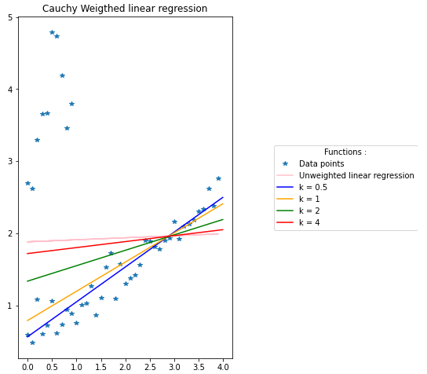

The following plot represents how the outliers and inliers are affected by the cost function and weight function. 
The poor results of k = 4 can also be seen in this plot.
Indeed, the weight of some outliers is the same as the weight of some inliers for lower values of k. 
For values of k too big (relative to the point cloud, illustrated by k = 4 in the exemple) some outliers will be considered as inliers.
The opposite effect can happen where the value of k is so low (illustrated by k = 0.01) that some inliers are downweighted like outliers. 
Indeed, low values of k will not give better results since numerous inliers will be heavily downweighted.
In the example k = 0.01 downweight most of the inliers to 0. 
This means that some prior knowledge of the point cloud is necessary for a fine tuning of the k parameter.

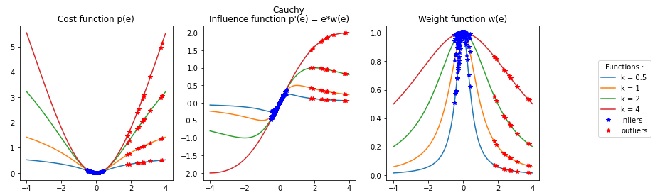

Methods can be used to prevent the tuning of k. 
If the inliers are affected by a Gaussian perturbation with a 0 mean then S-estimators can be used to fine tune k used by the M-estimator. 
Libpointmatcher provides one S-estimator called Median absolute deviation (MAD). S-estimators are beyond the scope of this catalog.

## Families Catalog

### Pseudo-Sinus Family 

This family of outlier filters is characterized by an influence function that looks like one period of the sinusoid function. 
The value of k affects the width of the period. 
Past the sinusoidal behavior, the influence function becomes null. 
Usually, inliers are affected by the sinusoidal part, while the outliers are affected by the null part of the function.

The sinusoidal aspect of this family is well presented by Andrew and Tukey which provides a sharp transition between the effect on inliers and outliers. 
Welsch, Cauchy and Geman-McClure provide an influence function with a smooth transition between the effect on inliers and outliers.
Kernel-Correlation (KC) and Fast Global Registration (FGR) are identical to other functions of the family. 
Therefore, Welsch and Geman-McClure are hidden under KC and FGR and can't be seen on the plot because they overlap with these functions.

#### Cauchy 

**Equations:**

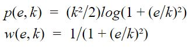

**Plots:**

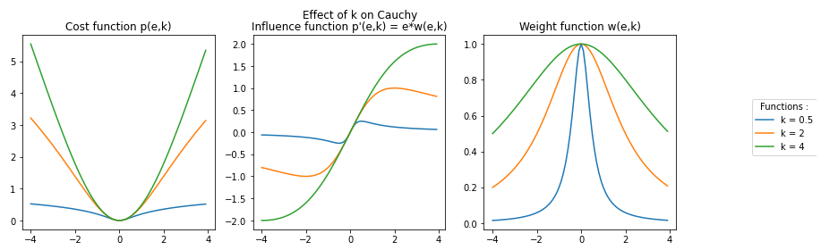
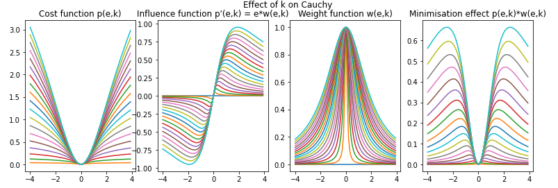

**Reference of its use in ICP:**

* M. Bosse and R. Zlot, "Continuous 3D scan-matching with a spinning 2D laser", 2009 IEEE International Conference on Robotics and Automation, pp.4312-4319, 2009.

#### Geman-McClure 

**Equations:**

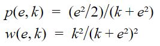

**Plots:**

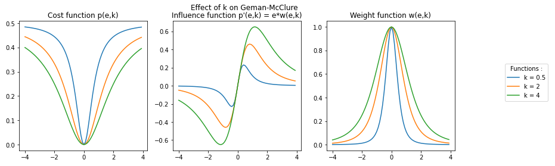
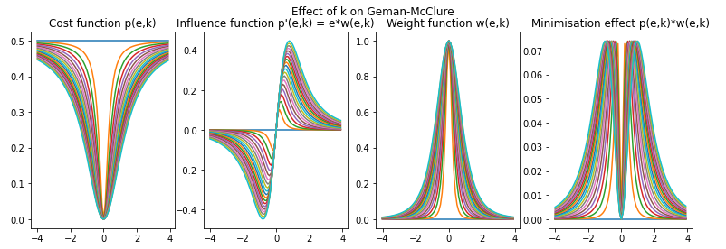

**Reference of its use in ICP:**

* S. Geman, D.E. McClure, and D. Geman, "A nonlinear filter for film restoration and other problems in image processing", CVGIP: Graphical Models and Image Processing, vol. 54, no.4, pp.281-289, 1992.

This outlier filter is also used in an registration algorithm called Fast Global Registration (FGR):
* Q.Y. Zhou, J. Park, and V.Koltun, "Fast global registration", Lecture notes in Computer Science, vol.9906 LNCS, pp. 766-782, 2016

#### Welsch 

**Equations:**

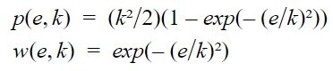

**Plots:**

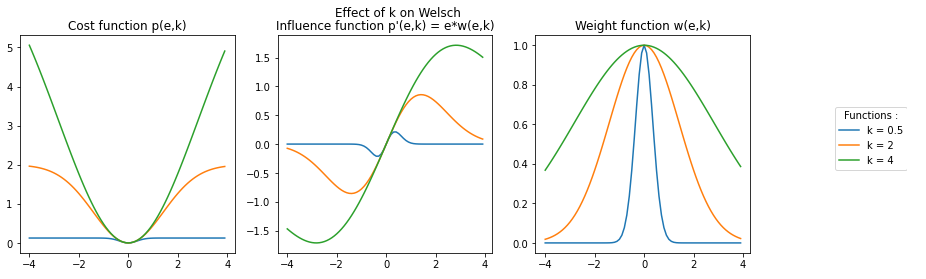
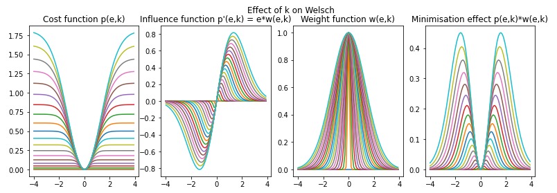

**Reference of its use in ICP:**

* R.E. Welsch, "Robust Regression Using Iteratively Reweighted Least-squares", Communications in Statistics - Theory and Methods, vol. 6, no. 9, pp.813-827, 1977.

This outlier filter is also used in the registration algorithm called Kernel-Correlation (KC):
* Y.Tsin and T.Kanade, "A Correlation-Based Approach to Robust Point Set Registration", in 8th European Conference on Computer Vision, vol.0 , 2004, pp.558-569.

#### Tukey 

**Equations:**

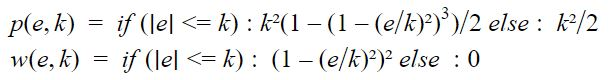

**Plots:**

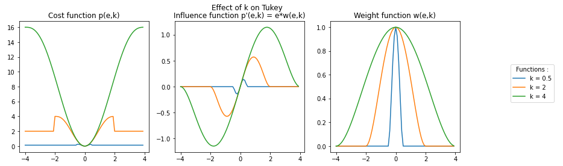
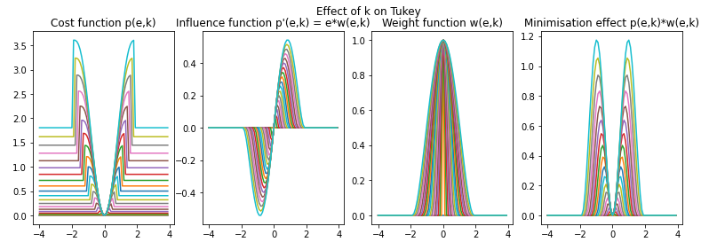

**Reference of its use in ICP:**

* R.E. Welsch, "Robust Regression Using Iteratively Reweighted Least-squares", Communications in Statistics - Theory and Methods, vol. 6, no. 9, pp.813-827, 1977.

#### Andrew 

**Equations:**

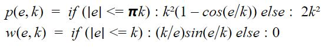

**Plots:**

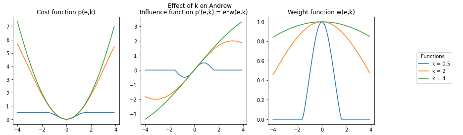
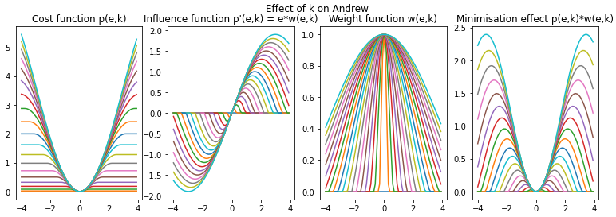

**Reference of its use in ICP:**

* R.E. Welsch, "Robust Regression Using Iteratively Reweighted Least-squares", Communications in Statistics - Theory and Methods, vol. 6, no. 9, pp.813-827, 1977.

### Linear Family 

This family of outlier filters is characterized by an influence function that looks like a linear function. 
Appart from L2, the value of k affects the width of the linear part. 
Past the linear behavior, the influence function becomes null. 
Usually, inliers are affected by the linear part of the function while the outliers are affected by the null part of the function.
The Switchable-Constraint outlier filter provides a smooth transition between the inlier and outlier part, while Maximum Distance provides a sharp transition between those two behaviors. 
L2 represents the ideal linear influence function. On the plot Maximum Distance and GICP are overlapping.

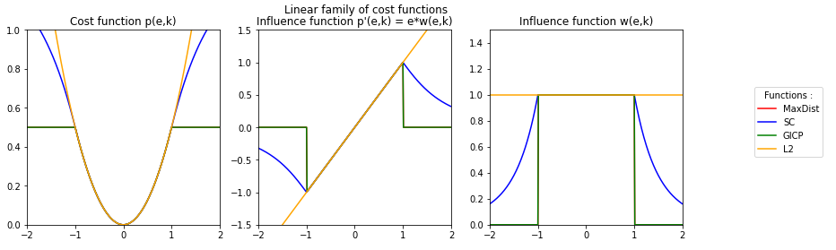

#### L2 

L2 is a function which is a part of the Lp space family of functions. This outlier filter is parameter less, so no parameter needs to be tuned.

**Equations:**

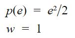

**Plot:**

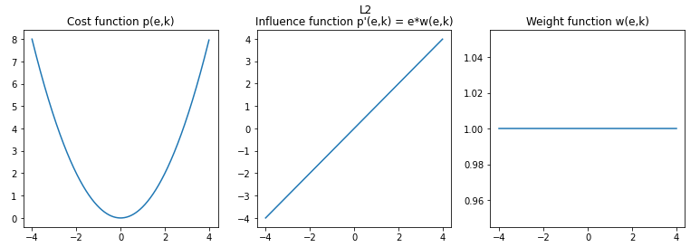

#### Switchable-Constraint 

**Equations:**

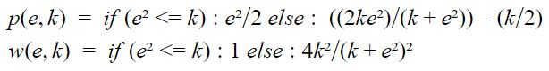

**Plots:**

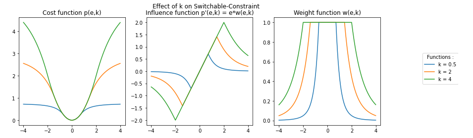
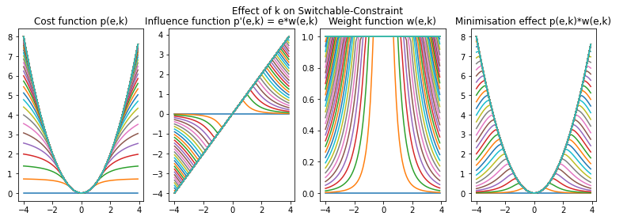

**Reference of its use in ICP:**

* N. Süderhauf and P. Protzel,"Switchable constraint for robust pose graph slam", in 2012 IEEE/RSJ International Conference on Intelligent Robots and Systems, 2012, pp. 1879-1884.
* P Argawal, G.D. Tipaldi, L. Spinello, C.Stachniss, and W.Burgard, "Robust map optimization using dynamic covariance scaling", IEEE international Conference on Robotics and Automation, pp. 62-69, 2013.

#### Maximum Distance (MaxDist) 

**Equations:**

**Plots:**

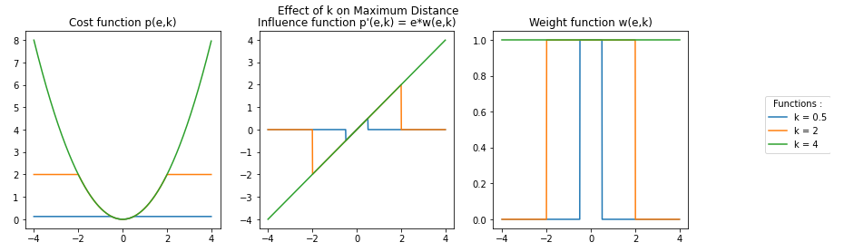
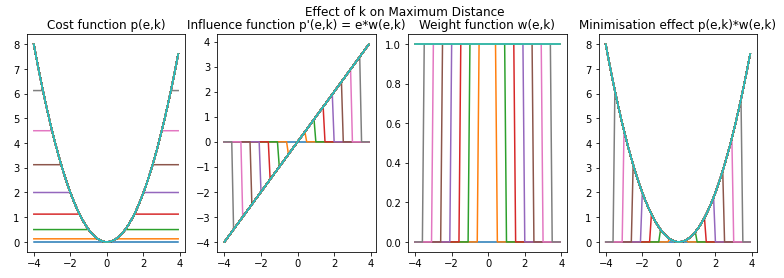

Maximum Distance is used in a variant of the ICP called Generalized-ICP or GICP:
* A.Segal, D.Haehnel, and S.Thrun, "Generalized-ICP", in Robotics: Science and Systems, vol.5, 2009, pp.168-176

### Step Family 

This family of outlier filters is characterized by an influence function that looks like a linear function. 
Apart from L1, the value of k affects the width of the linear part linking the step. 
Past the linear behavior, unlike the linear family the influence function becomes equal to -k or k. 
Usually, inliers are affected by the linear part while the outliers are affected by the -k/k part of the function. 
The Logistic outlier filter provides a smooth transition between the inliers and outliers parts while Huber provides a sharp transition between the two behaviors. 
L1 represents the ideal step function therefore it does not have a linear part. 
The LMICP outlier filter overlaps with the plot of Huber.

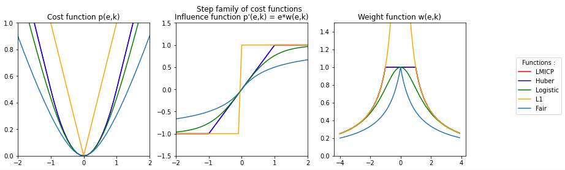

#### L1 

L1 is a function which is a part of the Lp space family of functions. 
This outlier filter is parameter-less, so no parameter needs to be tuned.

**Equations:**

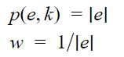

**Plot:**

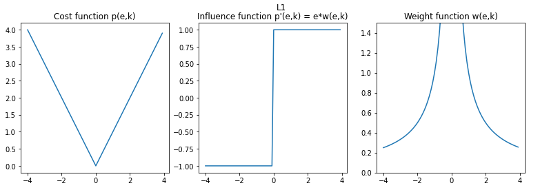

#### Huber 

**Equations:**

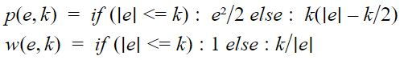

**Plots:**

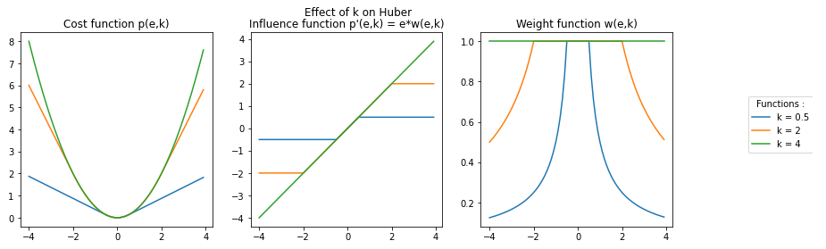
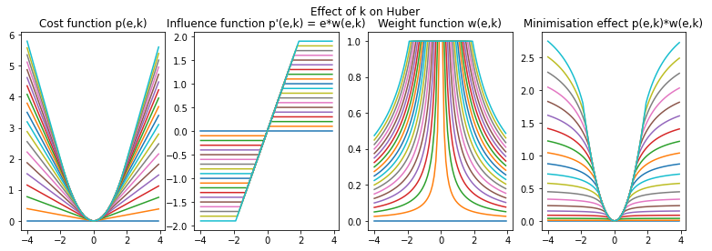

**Reference of its use in ICP:**

* P.J. Huber, "Robust Estimation of a Location Parameter", The Annals of Mathematical Statistics, vol.35, no. 1, pp. 73-101, 1964.

A variant of the ICP called LM-ICP uses Huber as an outlier filter:
* A.W. Fitzgibbon, "Robust registration of 2D and 3D point sets", Image and Vision Computing, vol.21, no.13-14, pp.1145-1153, 2003.

#### Logistic 

**Equations:**

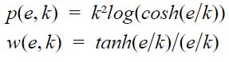

**Plots:**

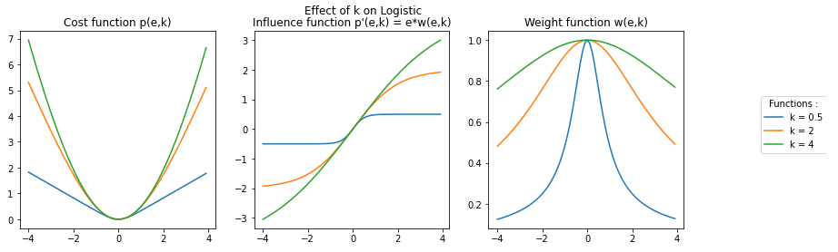
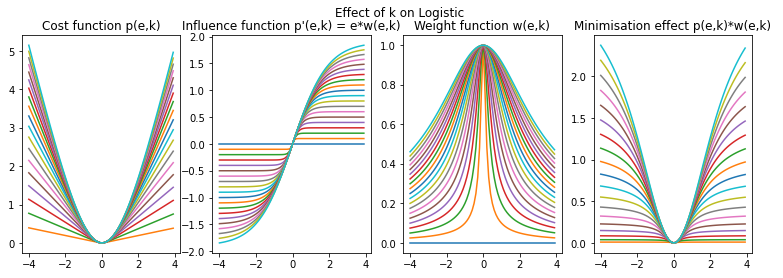

**Reference of its use in ICP:**

* R.E. Welsch, "Robust Regression Using Iteratively reweighted Least-squares", Communications in Statistics - Theory and Methods, vol. 6, no.9, pp.813-827, 1977.

#### Fair 

**Equations:**

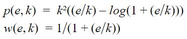

**Plots:**

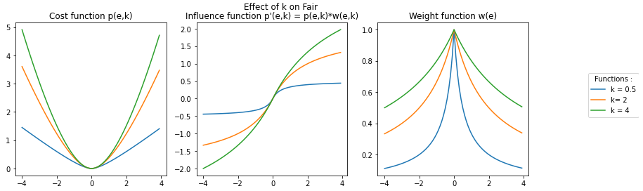
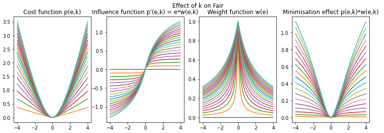

**Reference of its use in ICP:**

* R.E. Welsch, "Robust Regression Using Iteratively reweighted Least-squares", Communications in Statistics - Theory and Methods, vol. 6, no.9, pp.813-827, 1977.

### Percentile Family 

This family of outlier filters uses the percentile in order to affect a binary weight. 
The values past the f percentile are considered as outliers. 
Trimmed, Articulated ICP (AICP), and Fractional ICP (FICP) are the same outlier filters and have a tunable value of f. 
Median is the same as the other percentile filters, however it's value is non-tunable and equal to 50%. 
The value of f must be equal to the overlap ratio parameter.

**Equation:**

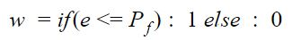

This filtering method doesn't rely on a function. 
In order to illustrate it's effect, a Gaussian density function was applied to the range of errors [-4,4] with a step of 0.1. 
With this simplified problem the overlap ratio parameter can't be computed therefore we affect arbitrary values to f. 
Respectively for Trimmed, AICP and FICP the values of f are 30%, 60% and 90%.

AICP is an ICP variants. The outlier filtering method is the same as Trimmed but an external module is used to tune the value of f.

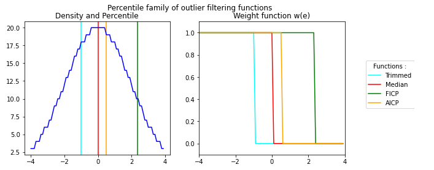

**Reference of its use in ICP:**

* Trimmed: D.Chetverikov, D.Svirko, D.Stepanov and P.Krsek, "The Trimmed Iterative Closest Pointalgorithm", Object recognition supported by user interaction for service robots, vol.3, no. c, pp.545-548, 2002.
* Median: A.Censi, "An ICP variant using point-to-line metric", IEEE International Conference on Robotics and Automation (ICRA), pp. 19-25, 2008.
* FICP (i.e. Var. Trim.): J.M.Phillips, R.Liu, and C.Tomasi, "Outlier robust ICP for minimizing fractional RMSD", in 3DIM 2007 - Proceedings 6th International Conference on 3-D Digital Imaging and Modeling, 2007, pp.427-434.
* AICP: S.Nobili, R.Scona, M.Caravagna, and M.Fallon, "Overlap-based ICP tuning for robust localization of a humanoid robot", in Proceedings - IEEE International Conference on Robotics and Automation, 2017, pp.4721-4728.

### Other Family 

This family of function regroups outlier filters that can't be categorized. 
This is due to their behavior charging drastically (Student, Sparse ICP), dependent of a value and k (RMT, BiDistance) or a different algorithm that doesn't rely on functions (RANSAC).
Due to the diversity of those functions a plot for the family can't be provided.

The outlier filters RANSAC, RMT and BiDistance requires a problem in order to be computed. 
Therefore, the algorithm was applied to a linear regression problem on a cloud of points presenting 17% of outliers.

#### Student 

**Equations:**

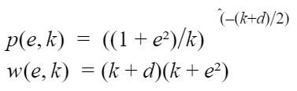

**Plots:**

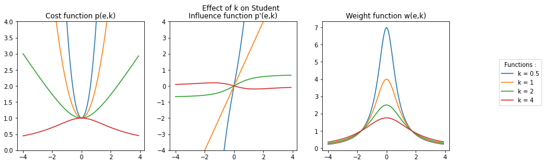

**Reference of its use in ICP:**

* G.Agamennoni, S.Fontana, R.Y. Siegwart, and D.G. Sorrenti, "Point Clouds Registration with Probabilistic Data Association", IEEE/RSJ International Conference on Intelligent Robots and Systems (IROS), pp.4092-4098, 2016.

#### Sparse ICP 

Sparse ICP is an outlier function based on the Lp norm therefore it uses a tuning parameter p. 
In the plots the parameter is noted k so that it can't be mistaken for the result of the cost function p(e,k). 
This function is only applicable for values of k in the range [0,1]. 
It is relevant to point out that Sparse ICP for k = 1 is equal to L1.

**Equations:**

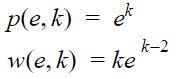

**Plots:**

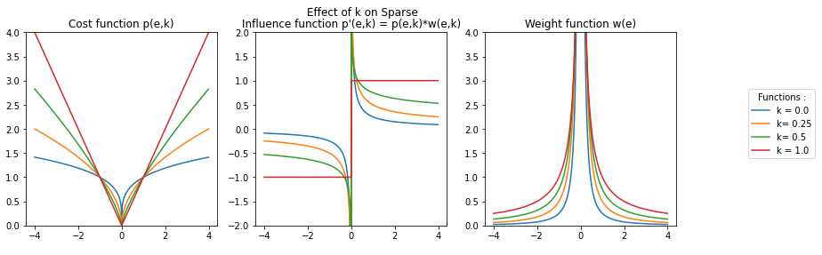

**Reference of its use in ICP:**

* S.Bouaziz, A.Tagliasacchi, and M.Pauly, "Sparse iterative closest point", Eurographics Symposium on Geometry Processing, vol.32, no.5, pp. 113-123, 2013.

#### EM-ICP 

The EM-ICP algorithm presents an effect on inliers similar to the step function. 
This is due it being based on L1. 
The effect on outliers is the same as the functions in the linear or sin families. 
Since the outlier filtering method is a trimmed version on L1 and it shares behavior with the step and linear families, it is placed in the other family.

**Equations:**

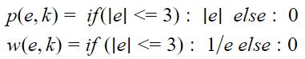

**Plots:**

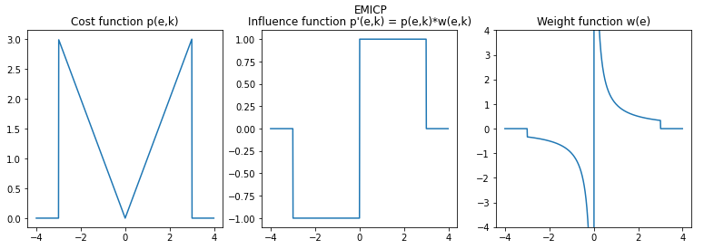

**Reference of its use in ICP:**

* S.Granger, and P.Xavier, "Multi-scale EM-ICP: A Fast and Robust Approach for Surface Registration", Proceedings of the European Conference on Computer Vision, pp. 418-432.

#### RANSAC 

The RANSAC outlier filtering algorithm or RANdom SAmple Consensus relies on a voting system that uses inliers. 
The first step of the algorithm is to randomly sample the cloud of points. 
Then, a model is applied depending on the problem. 
This model is applied to the sampled points. After the model is computed, the algorithm counts the number of values contained within a [-k,k] range from the model. 
These values are considered as inliers. 
The model with the highest number of inliers is considered as the result of the algorithm. The RANSAC algorithm uses three parameters:
* (s): the number of sampled points
* (c): the number of computations
* (k): the range containing the inliers
Since the algorithm is based on random sampling, the results can be quite independent of k as shown with the plots.
Indeed, for the same amount of points and the same number of computations the result for k = 0.5 ended up being poorer than the example using k = 1.5. 
This can be explained by the fact that (s) is the predominant tuning parameter for this algorithm.

**Plots:**

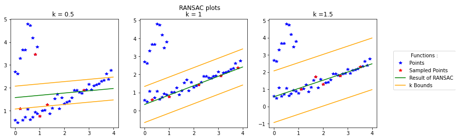

**Reference of its use in ICP:**

* M.A.Fischler and R.C. Bolles, "Random sample consensus: a paradigm for the model fitting with applications to image analysis and automated cartography", Communications of the ACM, vol.24, no.6, pp.381-395, 1981.

#### Relative motion threshold (RMT) 

The relative motion threshold (RMT) uses a threshold based on translation between two transforms. 
In our simplified case this motion threshold was the mean of the absolute values of the translation on the y axis between two iterations. 
This simplified example shows that if dt is correctly computed, even the most outrageous initial values can give a good regression result. 
In the following plots we gave an example with intial values equal to an unweighted linear regression. 
Then in the second plot the initial values are set to start the regression in the outlier point cloud. 
In both cases the results are well within the inliers point cloud and give equal results up to the first decimal place. 
Therefore the results of RMT are more dependent of the way dt is computed than the initial values given to the outlier filter.

**Equations:**

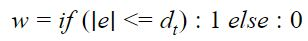

**Plots:**

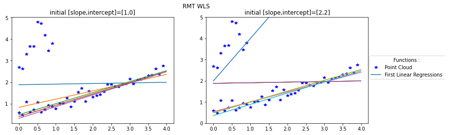

**Reference of its use in ICP:**

* F.Pomerleau, F.Colas, F.Ferland, and F.Michaud,"Relative Motion Threshold for Rejection in ICP Registration", Field and Service Robotics, vol.62 p.229-238, Jul.2015.

#### BiDisance 

The BiDistance outlier filtering method affects an uniform weight based on the tuning parameter k and a parameter computed at each iteration noted B. 
This computed parameter is the bidirectional correspondence between the two point sets. Since this outlier filter is a weight function with two variables, it can be plotted as a 3D graph. 
For the example the plot was made by values of k and B in the range [-2,2] with a step of 0.02. 
The weight function results can get really high due to the exponential in the equation, therefore the axis of the weight is limited to [0,4].

**Equation:**

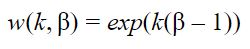

**Plots:**

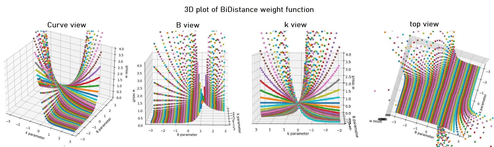

**Reference of its use in ICP:**

* J.Zhu, D.Wang, X.Bai, H.Lu, C.Jin, and Z.Li, "Regression of point clouds based on the ratio of bidirectional distances", Proceedings of the 4th international Conference on 3D vision, pp.102-107, 2016.